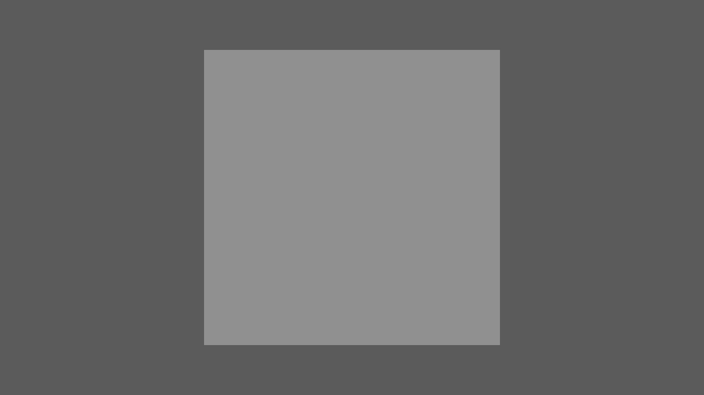
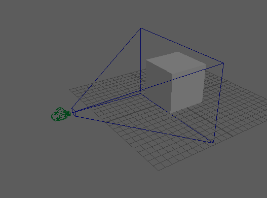

# Maya TurnTable Playblast

Simple generator to create a TurnTable camera around an asset and generate a playblast in Maya.

## Demo

Below is a quick example playblast result generated by this tool.

## Visualization

During development, I used the view frustum visualization to debug and validate camera placement and FOV. This is optional for users but helpful for understanding framing.

- Code: `view_frustum_crv_generator.py`
- Result example:

## Features

- TurnTable camera creation with automated framing based on asset bounds

## File Overview

- `playblast_generator.py`: Base class that wraps `cmds.playblast`, options, and template hooks for frame range.
- `TurnTable_generator.py`: Concrete generator that composes a camera creator and hooks frame changes to update keys.
- `camera_creator.py`: Creates/positions a camera + group and lays down a 360° rotateY spin and manages cleanup.
- `position_calculator.py`: Computes camera position from camera FOV and target asset bounding box.
- `view_frustum_crv_generator.py`: Utility to draw camera frustum curves for visualization.

## Requirements

- Autodesk Maya with Python (tested with Maya Python API commands via `maya.cmds` and `maya.api.OpenMaya`).
- Access to a scene node named `asset` or adjust the target group name when computing positions.
